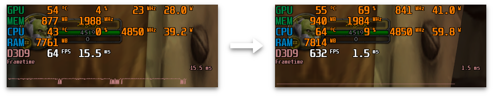

# VanillaFixes

A client modification for World of Warcraft 1.12.1 to eliminate stutter and animation lag.

Download here: [Releases](https://github.com/hannesmann/vanillafixes/releases)



## Will I get banned for using this?

As always, you should use tools like these **at your own risk**, but I haven't found any evidence that VanillaFixes could trigger the Warden anticheat.

VanillaFixes does not modify the game executable, permanently modify any game code, hook any Windows API functions or keep running in the background during gameplay. As soon as you see the login screen it has already been unloaded.

During startup VanillaFixes will modify timing variables in memory to force the game to use a high precision timer. Warden has a check to verify that time functions in the game are behaving as expected (to detect speedhacks, etc) and it's possible that these changes could cause it to fail, but in my testing I found no evidence for that being the case ([test on VMaNGOS](docs/vmangos-timing-check.png)).

## Compatibility with other mods

* **Nampower:** VanillaFixes.exe will load [Nampower](https://github.com/namreeb/nampower) if the DLL is present in the game directory.

* **FoV changers, large address patchers, etc**: These usually modify WoW.exe and will still work.

* **DLL injectors and launchers:** These will only work if they load VfPatcher.dll before the game starts. Injecting at the login screen won't work.

## Installation

1. Extract the zip file and copy all files to the same folder as WoW.exe.

2. Update your WoW shortcut to point to VanillaFixes.exe instead of WoW.exe.

## Using a custom executable

If you run WoW from a non-standard executable (for example: WoW_Tweaked.exe or WoWFoV.exe) you can add the executable name to the end of the command line (like this:
`"path\to\VanillaFixes.exe" CustomExecutableName.exe`) or you can drag and drop the executable over VanillaFixes.exe.

## Compiling

Building VanillaFixes requires a recent version of the Windows SDK (10.0.22000.0+) and [CMake](https://cmake.org). If you're on Linux, use [msvc-wine](https://github.com/mstorsjo/msvc-wine). Ninja (https://ninja-build.org) or Visual Studio can be used to build the project.

To build with Ninja, open the x86 VS Native Tools command prompt and run the following commands in the project directory:
```
git submodule update --init

mkdir build
cd build

cmake -G Ninja ..
ninja
```
